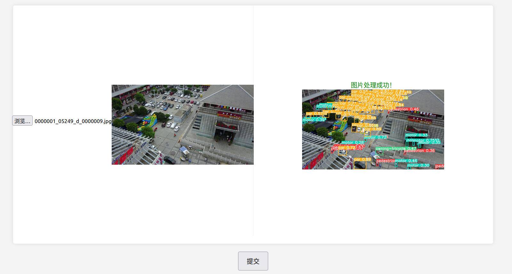

# MyTinyNetWorkLibrary

| Part1              | Part2               | Part3               | Part4               | Part5               | Part6               |  |
| ------------------ | ------------------- | ------------------- | ------------------- | ------------------- | ------------------- | - |
| [项目简介](#项目简介) | [项目特点](##项目特点) | [项目搭建](##项目搭建) | [运行展示](##运行展示) | [网络架构](##网络架构) | [模块讲解](##模块讲解) |  |

## 项目简介

本项目实现了一个高性能的在线目标检测识别的服务器。通过在云端部署先进的目标检测识别算法模型，为使用者提供便捷高效可扩展的解决方案。使用者无需担心算法的实现、模型的训练和部署等复杂问题，只需通过简单的API调用便可以快速获取精确的检测识别结果。服务器的网络框架采用主从Reactor模型加线程池的模式。支持解析Get、Post请求，支持解析multipart/form-data，支持文件以及图片的上传和保存。 此外还实现了日志系统监控服务端的工作状态。

## 项目特点

* 使用C++11编写去除了对Boost库的依赖。
* 底层使用 Epoll + LT 模式的 I/O 复用模型，并且结合非阻塞 I/O  实现主从 Reactor 模型。
* 采用「one loop per thread」线程模型，并向上封装线程池避免线程创建和销毁带来的性能开销。
* 基于自实现的双缓冲区实现异步日志，由后端线程负责定时向磁盘写入前端日志信息，避免数据落盘时阻塞网络服务。
* 基于红黑树实现定时器管理结构，内部使用 Linux 的 timerfd 通知到期任务，高效管理定时任务。
* 遵循 RAII 手法使用智能指针管理内存，减小内存泄露风险。
* 利用有限状态机解析 HTTP 请求报文，支持解析multipart/form-data表单。
* 参照 Nginx 实现了内存池模块，更好管理小块内存空间，减少内存碎片。
* 图片支持保存在云端、路径和检测结果则存储在MySQL中。
* 数据库连接池可以动态管理连接数量，及时生成或销毁连接，保证连接池性能。
* 实现了时间轮，并利用时间轮定时踢掉超时的TCP连接。

## 项目搭建

安装Cmake

```shell
sudo apt-get update
sudo apt-get install cmake
```

下载项目

```shell
git clone git@github.com:Zhangjf-code/MyTinyNetworkLibrary.git
```

执行脚本构建项目

```shell
cd ./MyTinyNetworkLibrary
./autobuild.sh
```

## 运行展示

启动项目，默认监听10001端口 -> 在浏览器上进行访问 -> 选择图片并上传 -> 提交 -> 获得结果并返回展示




## 网络架构

参照了muduo库的实现，主从Reactor模型+线程池。


## 模块讲解

* 定时器
* 时间轮
* 异步日志
* 内存池
* HTTP
* 连接池
* 目标检测识别
