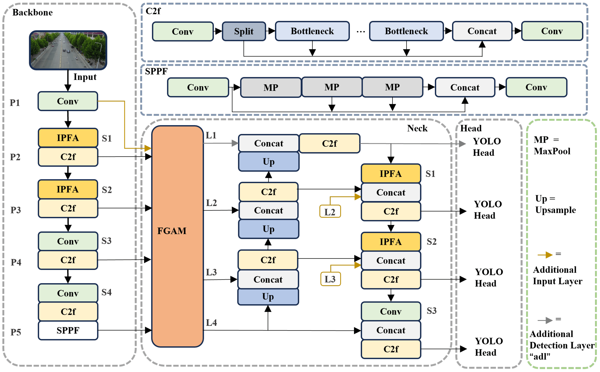
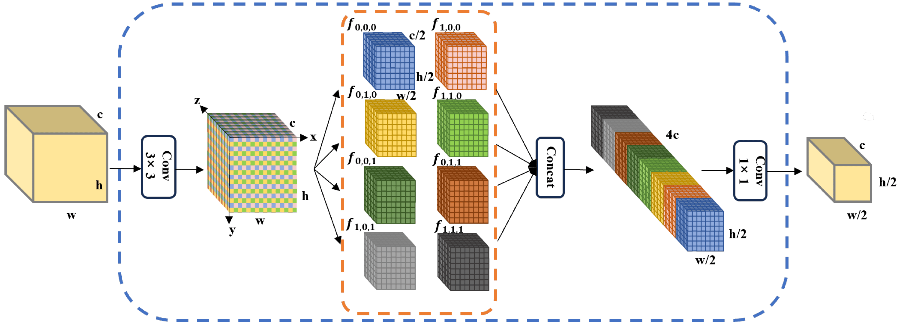
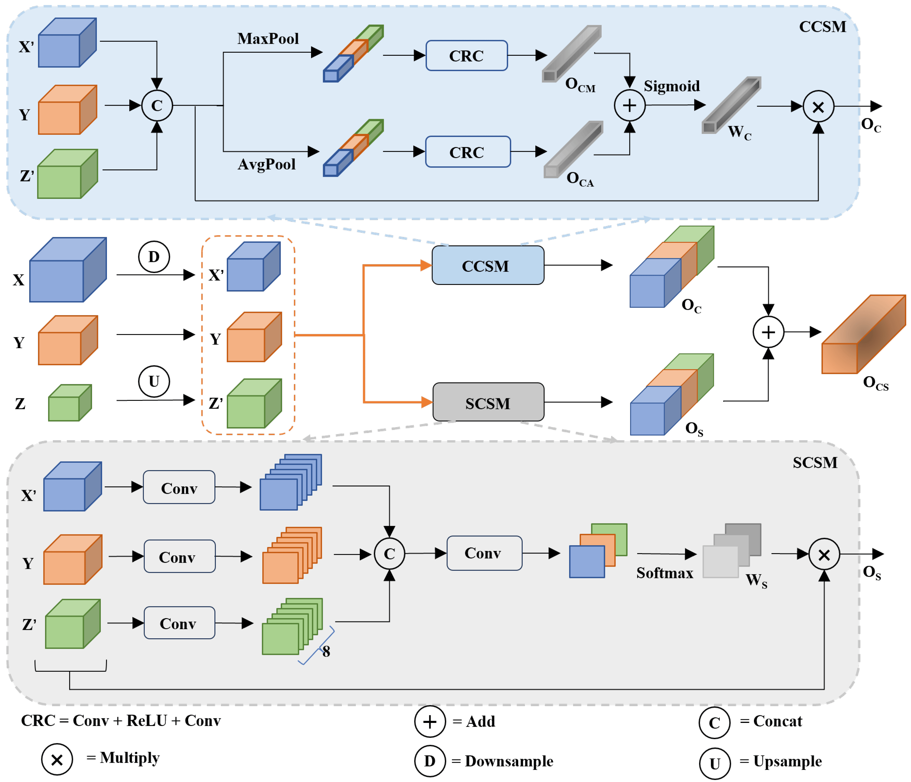
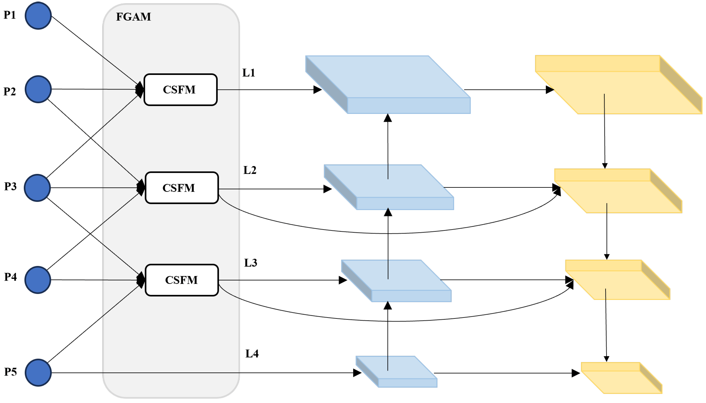

## 基于信息无损及细粒度特征聚合的无人机目标检测识别算法

针对无人机航拍图像中小目标占据的像素少，且特征信息容易被背景遮挡的问题，提出了信息无损和细粒度特征聚合模块，解决了无人机对象检测中的小目标和弱目标检测难题，提高了检测性能。

[文章链接](https://doi.org/10.3390/rs16142590)

**信息保留特征聚合（IPFA）模块** ：

* 问题描述：传统的特征聚合方法如步长卷积可能导致输入样本的信息损失。
* IPFA模块作用：通过跨多个维度（特别是通道维度）分割和重新组合特征，构建更抽象的语义特征表示，同时保留输入图像中的细粒度信息。
* 应用场景：在YOLOv8的骨干和颈部部分替换传统方法，增强模型性能。

  

**冲突信息抑制特征融合模块（CSFM）** ：

* 问题提出：直接融合不同层级的特征图会引入大量冗余和冲突信息。
* CSFM模块构成：包含通道冲突信息抑制模块（CCSM）和空间冲突信息抑制模块（SCSM），分别挖掘输入特征在通道和空间维度上的重要信息。
* 工作原理：通过自适应平均池化和自适应最大池化压缩输入特征，生成代表全局图像特征的输出特征图，并使用注意力机制指导模型关注更重要信息，丢弃冲突信息。

  

**细粒度聚合特征金字塔网络（FGAFPN）** ：

* 问题分析：直接融合不同密度的信息会导致语义冲突，限制多尺度特征的表达。
* FGAFPN功能：在骨干网络的多个层级特征图上使用细粒度特征聚合模块（FGAM），实现不同层级特征图之间的信息交互。
* 效果提升：在输入金字塔网络中减少多级特征图的信息密度差异，减轻冲突信息的生成，提高目标检测性能。

  

**实验与评估** ：

* 数据集：使用VisDrone2019数据集进行手动标注对象信息的实验。
* 评估指标：主要关注模型的检测性能和复杂度，采用多种指标衡量模型可靠性。
* 实验结果：IF-YOLO在VisDrone2019-val数据集上的mAP相比PANet和BiFPN有所提升，展现出更高的准确性和鲁棒性。

**模型复杂度** ：

* 计算复杂度：IF-YOLO的计算复杂度为47.5 GFLOPS，相对较高，但这是由于为了捕捉复杂场景中小对象的全面特征信息而进行的额外改进。

**未来展望** ：

* 挑战与机遇：尽管IF-YOLO在无人机对象检测方面表现出色，但在低光照、模糊和遮挡等挑战性条件下仍面临困难。
* 改进方向：考虑结合图像增强技术和轻量级策略，以提高模型的整体有效性、通用性和在边缘设备上的适应性。
